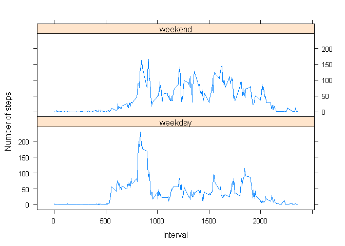

# Reproducible Research: Peer Assessment 1

## Loading and preprocessing the data

```r
library(plyr)
library(ggplot2)
library(lattice)

activitydata<-read.csv("./dataset/activity.csv",head=T)
#we should convert date column to Data class in r.
activitydata$date<-as.Date(activitydata$date)
```
The data set contain three column. Here is first few rows of this data set.

```r
head(activitydata,n=3)
```

```
##   steps       date interval
## 1    NA 2012-10-01        0
## 2    NA 2012-10-01        5
## 3    NA 2012-10-01       10
```

## What is mean total number of steps taken per day?
In order to compute mean total number of steps taken per day and to draw histogram, we should summarise activity data set according to date. According to the assignment, at this stage we can ignore incomplete data sets.

```r
newdataset1<-ddply(na.omit(activitydata),"date",summarise,totalsteps=sum(steps))
```
Here is first few rows of this summarised data set.

```r
head(newdataset1,n=3)
```

```
##         date totalsteps
## 1 2012-10-02        126
## 2 2012-10-03      11352
## 3 2012-10-04      12116
```
Now we can draw the histogram for total number of steps taken per day.

```r
qplot(x=newdataset1$date,y=newdataset1$totalsteps,geom="bar",stat="identity",xlab=expression(bold("Date")),ylab=expression(bold(" Total Steps"))) 
```

 

mean and median number of steps taken per day is calulated as follows:


```r
meansteps<-mean(newdataset1$totalsteps)
mediansteps<-median(newdataset1$totalsteps)
```
**mean total number of steps taken per day** = 

```
## [1] 10766
```
**median total number of steps taken per day**=

```
## [1] 10765
```
## What is the average daily activity pattern?

In this section we should make a time series plot of the 5-minute interval (x-axis) vs the average number of steps taken, averaged across all days (y-axis). After that
 we should find the interval ID, which contains the maximum number of steps (when averaged across all days). To do that we should summaeaise data according to interval ID. At this stage, we can ignore missing values.
 

```r
 newdataset2<-ddply(na.omit(activitydata),"interval",summarise, avgsteps=mean(steps))
```
Before we continue to analysis, here few rows of this summarised data set

```r
head(newdataset2, n=3)
```

```
##   interval avgsteps
## 1        0   1.7170
## 2        5   0.3396
## 3       10   0.1321
```
Now we can draw the time series plot beween interval and average number of steps.

```r
qplot(x=newdataset2$interval,y=newdataset2$avgsteps,geom="line",stat="identity",xlab=expression(bold("Interval ID")), ylab =expression(bold(" Average Steps (across all days)")) )
```

 

**The interval ID, which contain maximum number of steps (averaged across all days) is **

```r
maxstepineterval<-newdataset2[which.max(newdataset2$avgsteps),]
maxstepineterval
```

```
##     interval avgsteps
## 104      835    206.2
```

## Imputing missing values
In this part of the assignment, we have to consider missing values. First thing we need to do is find out how many incomplete data rows are in the activity data set.

**Total number of missing values**=


```r
totalmissingval<-sum(!complete.cases(activitydata))
totalmissingval
```

```
## [1] 2304
```

### Strategy to fill missing values
Now we should devise a strategy to fill missing values. Before that we should try to understand the data set. First look at the interval ID. Interval id are like 0,5,10,...2355. Most intutive interpretation for these interval ID is it is time given according to 24 hour clock. So, "0" mean "12.00AM", "5" mean "12.05AM"...."2355"" mean "23:55PM". Now with this interpretation if we look at the time series plot in above (interval vs avgsteps ) we can see that from 12.00AM-5.00AM there are almost zero movements( due sleep ?). Then starting around 7.00AM, movements starts to increase. We also found above maximum number of movements occur at 835 interval(8.35AM ? may be becauae of daily walking exercise? ). If we use this intutive interpretaion of data set, then I think best way to **fill missing values of given interval ID is using mean of that interval ID taken across all days**. Now we can make new dataset with missing values filled.


```r
newactivitydata<-activitydata

for(rownum in 1:nrow(newactivitydata)){
  if(is.na(newactivitydata[rownum,]$steps)==TRUE){
    #If step values are missing for particular data row then first we extract the interval ID of that row.
    intervalid<-newactivitydata[rownum,]$interval 
    #Now we use newdataset2 created in above to get average steps for that particular interval id.
    averagesteps<-subset(newdataset2,newdataset2$interval==intervalid)$avgsteps
    #After we extract average steps from newdataset2, we use this to replace missing steps.
    newactivitydata[rownum,]$steps<-averagesteps
}
  
}
```

Here is first few rows of this **new dataset**.

```r
head(newactivitydata,n=3)
```

```
##    steps       date interval
## 1 1.7170 2012-10-01        0
## 2 0.3396 2012-10-01        5
## 3 0.1321 2012-10-01       10
```

Now we can draw the histogram for total number of steps taken per day.

```r
newdataset3<-ddply(newactivitydata,"date",summarise,totalsteps=sum(steps))
qplot(x=newdataset3$date,y=newdataset3$totalsteps,geom="bar",stat="identity",xlab=expression(bold("Date")),ylab=expression(bold(" Total Steps"))) 
```

 

mean and median number of steps taken per day is calulated as follows:

**mean total number of steps taken per day** = 

```r
newmeansteps<-mean(newdataset3$totalsteps)
newmeansteps  
```

```
## [1] 10766
```
**median total number of steps taken per day**=

```r
newmediansteps<-median(newdataset3$totalsteps)
newmediansteps
```

```
## [1] 10766
```

If we compare these values with first part of assignment, it is look like these estimates do not differe from previous one. So we can conclude, missing value does not have big impact on mean steps and median steps.

## Are there differences in activity patterns between weekdays and weekends?
First we should create new factor variable, which identify date as "weekday" and "weekend". For this part of assignment, we should use data set we created in above.


```r
newactivitydata$isweekend<-factor(weekdays(newactivitydata$date)%in%c("Sunday","Saturday"))
levels(newactivitydata$isweekend)<-c("weekday","weekend")
```

Here few rows of this data set with new column.


```r
head(newactivitydata,n=3)
```

```
##    steps       date interval isweekend
## 1 1.7170 2012-10-01        0   weekday
## 2 0.3396 2012-10-01        5   weekday
## 3 0.1321 2012-10-01       10   weekday
```

To see whether there is any difference in between weekday movements and weekend movements first we graph interval id vs average steps across all weekdays or weekends.


```r
averagestepsdata<-ddply(newactivitydata,c("interval","isweekend"),summarise, avgsteps=mean(steps))
xyplot(avgsteps~interval|isweekend, data=averagestepsdata, type= "l",layout=c(1,2),xlab="Interval", ylab="Number of steps")
```

 

Now according to graphs we can see that there is no significant diference in activity between weekdays and weekends(Eventhough there is more movements in weekends, patterns of activity look like more or less same). 
